# Entity Relationship Diagram

Sourced by introspecting the live PostgreSQL database (`information_schema` +
`pg_catalog`), not hand-written from the Prisma schema. The canonical Mermaid
source is [`erd.mmd`](./erd.mmd); the block below is the same diagram so GitHub
renders it.

```mermaid
erDiagram
    User {
        text id PK
        text name
        text email UK
        boolean emailVerified
        text image
        text role "manager | teacher (default teacher)"
        text phone
        timestamp createdAt
        timestamp updatedAt
    }

    Session {
        text id PK
        timestamp expiresAt
        text token UK
        timestamp createdAt
        timestamp updatedAt
        text ipAddress
        text userAgent
        text userId FK
    }

    Account {
        text id PK
        text accountId
        text providerId
        text userId FK
        text accessToken
        text refreshToken
        text idToken
        timestamp accessTokenExpiresAt
        timestamp refreshTokenExpiresAt
        text scope
        text password
        timestamp createdAt
        timestamp updatedAt
    }

    Verification {
        text id PK
        text identifier
        text value
        timestamp expiresAt
        timestamp createdAt
        timestamp updatedAt
    }

    students {
        text id PK
        text firstName
        text lastName
        Sex sex
        timestamp dateOfBirth
        timestamp createdAt
        timestamp updatedAt
    }

    guardians {
        text id PK
        text firstName
        text lastName
        text email
        text phone
        text address
        timestamp createdAt
        timestamp updatedAt
    }

    student_guardians {
        text id PK
        text studentId FK,UK "unique per guardian"
        text guardianId FK,UK "unique per student"
        text relation "mother | father | ..."
        boolean isPrimary
        timestamp createdAt
        timestamp updatedAt
    }

    rooms {
        text id PK
        text name UK
        integer capacity
        timestamp createdAt
        timestamp updatedAt
    }

    levels {
        text id PK
        text name UK
        integer sortOrder
        timestamp createdAt
        timestamp updatedAt
    }

    class_sessions {
        text id PK
        text label UK "e.g. Saturday morning"
        text day "Saturday | Sunday"
        text period "morning | noon | afternoon"
        timestamp createdAt
        timestamp updatedAt
    }

    classes {
        text id PK
        text name
        text description
        text levelId FK
        text roomId FK
        text teacherId FK
        timestamp createdAt
        timestamp updatedAt
    }

    class_session_links {
        text id PK
        text classId FK,UK "unique per session"
        text sessionId FK,UK "unique per class"
        timestamp createdAt
        timestamp updatedAt
    }

    enrollments {
        text id PK
        text studentId FK,UK "unique per class"
        text classId FK,UK "unique per student"
        timestamp startDate
        timestamp endDate
        text status "active | withdrawn"
        timestamp createdAt
        timestamp updatedAt
    }

    student_comments {
        text id PK
        text studentId FK
        text authorId FK
        text body
        timestamp createdAt
        timestamp updatedAt
    }

    guardian_comments {
        text id PK
        text guardianId FK
        text authorId FK
        text body
        timestamp createdAt
        timestamp updatedAt
    }

    class_comments {
        text id PK
        text classId FK
        text authorId FK
        text body
        timestamp createdAt
        timestamp updatedAt
    }

    User ||--o{ Session : "authenticates via"
    User ||--o{ Account : "authenticates via"
    User |o--o{ classes : "teaches"
    User |o--o{ student_comments : "authors"
    User |o--o{ guardian_comments : "authors"
    User |o--o{ class_comments : "authors"

    students ||--o{ student_guardians : "is linked to"
    guardians ||--o{ student_guardians : "is linked to"

    students ||--o{ enrollments : "enrolls in"
    classes ||--o{ enrollments : "has enrolled"

    classes ||--o{ class_session_links : "runs in"
    class_sessions ||--o{ class_session_links : "schedules"

    levels ||--o{ classes : "classifies"
    rooms |o--o{ classes : "hosts"

    students ||--o{ student_comments : "has"
    guardians ||--o{ guardian_comments : "has"
    classes ||--o{ class_comments : "has"
```



## Legend

- `PK` primary key, `FK` foreign key, `UK` unique key.
- Cardinality: `||--o{` = one (mandatory) to zero-or-many; `|o--o{` = one
  (optional) to zero-or-many.
- Composite unique constraints (marked `UK` on each member column):
  `student_guardians (studentId, guardianId)`,
  `class_session_links (classId, sessionId)`,
  `enrollments (studentId, classId)`.
- `Sex` is a PostgreSQL enum: `MALE | FEMALE | OTHER`.
- `_prisma_migrations` (Prisma's bookkeeping table) is omitted — infrastructure,
  not application data.

## Regenerate

The diagram is derived from the database. To refresh it after a migration, dump
the structure and update `erd.mmd`:

```sh
# columns
docker exec moskee-db psql -U moskee -d moskee -c "\d+"
# or a machine-readable dump
pg_dump --schema-only --no-owner --no-privileges "$DATABASE_URL"
```
